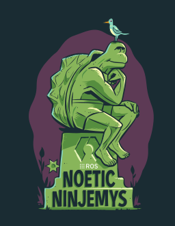

<nav class="rs-distros" aria-label="Distributions">
<a class="rs-distro" href="rolling.html">rolling</a>
<a class="rs-distro" href="lyrical.html">lyrical</a>
<a class="rs-distro" href="kilted.html">kilted</a>
<a class="rs-distro" href="jazzy.html">jazzy</a>
<a class="rs-distro" href="humble.html">humble</a>
<a class="rs-distro" href="galactic.html">galactic</a>
<a class="rs-distro" href="foxy.html">foxy</a>
<a class="rs-distro rs-distro--active" href="noetic.html" aria-current="page">noetic</a>
</nav>

# { .rs-art } ROS1 Noetic

<p class="rs-support">Released May 2020 &middot; end of life May 2025</p>

!!! warning "End of life"

    Noetic reached end of life in May 2025. Upstream no longer releases updates
    for it, so this table shows what was built while it was supported.

Every package in the [ROS index](https://index.ros.org/#noetic) for noetic, and whether
it is available on the [`robostack-noetic`](https://prefix.dev/channels/robostack-noetic) channel yet.

```sh
pixi workspace channel add https://prefix.dev/robostack-noetic
pixi add ros-noetic-<package>
```

<div class="rs-packages" data-distro="noetic" data-eol="1">
  <noscript>
    This table is rendered in the browser. Without JavaScript, browse the channel
    directly at <a href="https://prefix.dev/channels/robostack-noetic">prefix.dev/channels/robostack-noetic</a>.
  </noscript>
</div>
